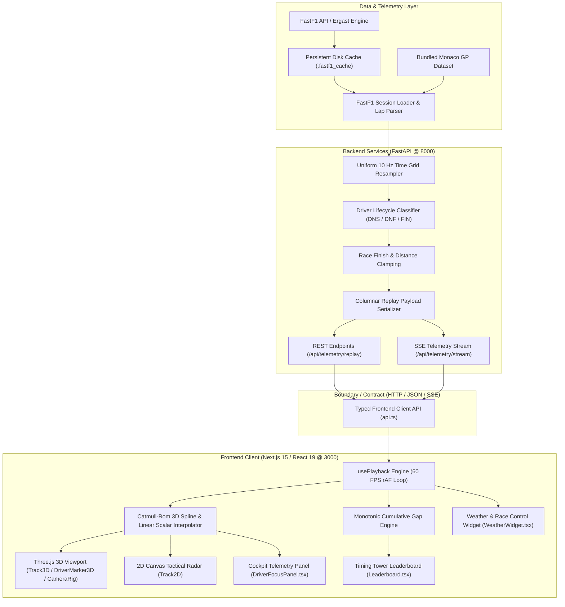

# VelociTrack F1 — 3D/2D Formula 1 Race Replay Engine


**VelociTrack F1** is a high-performance, full-stack 3D and 2D Formula 1 race replay engine powered by FastF1 telemetry. Engineered with a broadcast-grade dark titanium slate aesthetic (`#0b0e14`), neon team accents, glassmorphic HUD overlays, and smooth 60 FPS Catmull-Rom spline interpolation.

---

## Key Features

- **High-Precision Telemetry Pipeline:**
  - FastF1 session integration with persistent disk caching.
  - Dynamic multi-season schedule ingestion (2018–present) with word-bounded venue and circuit resolution.
  - Resamples raw, variable-rate car streams onto a uniform 10 Hz time grid.
  - Columnar data serialization reduces network payload sizes by over 80%.
  - Zero-wait cold start with a bundled Monaco Grand Prix high-fidelity demo dataset.
- **Universal Driver Lifecycle & Classification Engine:**
  - **Active Finishers:** Full telemetry and interpolation across all laps with official race finish clamping and chequered-flag ordering.
  - **Mid-Race Retirements (DNF):** Continuous tracking up to retirement timestamp $t_{\text{retire}}$, followed by automated 3D mesh despawning and locked `DNF | L{lap}` timing tower status.
  - **Non-Starters (DNS):** Formal classification for entered drivers who failed to start (`DNS | L0`), anchored to the bottom of the timing tower with suppressed 3D coordinate instantiation.
  - **Dynamic Grid Sizing:** Arbitrary grid scaling accommodating 20, 21, or 22+ cars (including 11-team expansions).
- **3D & 2D Tactical Viewports:**
  - **Three.js 3D Viewport (@react-three/fiber & @react-three/drei):** 3D extruded circuit ribbon, kerbs, sector boundaries, DRS activation zones, turn markers, and liveried driver pods with floating billboard tags.
  - **Cinematic Chase Cam:** Dynamic camera tracking with smooth spherical damping following any selected driver.
  - **Free Orbit Camera:** Full 360-degree rotation, pitch, and zoom across the circuit.
  - **2D Canvas Tactical Radar:** High-performance fallback radar view with real-time driver blips, gap labels, and pan/zoom controls.
- **Broadcast Telemetry HUD:**
  - **Dynamic Timing Tower:** Monotonic cumulative gap engine, interval to car ahead, DRS threat indicator ($<1.0\text{s}$), tire compound badges with lap age tooltips, and race status badges (`WINNER`, `FIN`, `DNF`, `DNS`).
  - **Cockpit Telemetry Panel:** Digital speedometer (km/h & mph), large gear display (`1`–`8`, `N`), 15-segment LED tachometer rev limiter shift lights, throttle/brake traces, and solid-state DRS status.
  - **Race Control & Weather Widget:** Live air/track temperatures, humidity, wind velocity and direction, and real-time FIA flag status (Green, Yellow, SC, VSC, Red Flag).
- **Interactive Playback Controls:**
  - Global scrubber bar with lap markers and interactive timeline seeking.
  - Speed multipliers: `0.5x`, `1x`, `2x`, `4x`, `8x`, `16x`.
  - Step jump controls (`-5s` / `+5s`), play/pause toggles, and keyboard shortcuts.
  - Cascading Season, Grand Prix, and Session selector with fuzzy year-over-year matching.

---

## Architecture

VelociTrack F1 separates high-throughput data processing in Python from smooth client-side visual interpolation in TypeScript/WebGL. 

### 1. Data Ingestion & Resampling Pipeline (Backend)
- **FastF1 Extraction:** Retrieves raw telemetry streams (X, Y, Z, Speed, RPM, Gear, Throttle, Brake, DRS, Distance, Lap, Compound, Pit Status) and session metadata.
- **Uniform Time-Grid Resampling:** FastF1 telemetry samples are recorded at irregular frequencies (1–20 Hz). The backend generates a uniform time vector $t \in [0, T]$ at $\Delta t = 0.1\text{s}$ (10 Hz) using NumPy 1D interpolation (`np.interp`) for continuous scalars and nearest-neighbor lookups for discrete states (gear, DRS, tire compound).
- **Driver Lifecycle Classification:**
  - Evaluates `session.results` and `session.laps` with dual identifier resolution (car number and 3-letter driver code).
  - DNS entries (0 completed laps) are flagged with `is_dns: True` and empty coordinate buffers (`x=[]`), saving bandwidth and preventing rendering glitches.
  - Mid-race DNF entries compute $t_{\text{retire}}$ from their final lap timestamp, setting `is_active: false` for subsequent frames.
  - Classified finishers compute $t_{\text{finish}}$ and target finish distance $d_{\text{finish}} = N_{\text{laps}} \times L_{\text{track}}$, clamping distance to prevent post-race run-off distortion.
- **Columnar Payload Serialization:** Telemetry is serialized as synchronized 1D arrays per channel (`x: [...]`, `speed: [...]`), eliminating JSON dictionary key repetition and compressing replay streams by over 80%.

### 2. Real-Time Playback & Interpolation Loop (Frontend)
- **Clock & RequestAnimationFrame Loop:** Playback progress is driven by a 60 FPS `requestAnimationFrame` loop that accumulates delta time multiplied by the active playback speed (`0.5x`–`16x`).
- **Catmull-Rom Spatial Spline:** The current replay time $t$ maps to fractional frame index $u = t / \Delta t$ with base index $k = \lfloor u \rfloor$ and interpolation fraction $\alpha = u - k$. For continuous spatial coordinates $(x, y, z)$, a Catmull-Rom spline evaluates points across 4 consecutive frame nodes $(k-1, k, k+1, k+2)$ with Centripetal parametrization to produce smooth vehicle movement through corners.
- **Scalar Telemetry Interpolation:** Continuous scalar channels (speed, throttle, brake, RPM) are linearly interpolated between frames $k$ and $k+1$. Discrete states (gear, DRS, pit status) use step evaluation at frame $k$.
- **Monotonic Cumulative Gap Engine:** Rather than dividing distance by fluctuating instantaneous velocities, gaps are computed by accumulating relative deltas between adjacent cars using circuit reference pace ($\Delta t_i \ge 0$). This guarantees strictly ascending, monotonic timing tower gaps ($0 < \text{gap}_2 < \text{gap}_3 < \dots$) without gaps inverting in slow hairpins or pit stops.

### 3. State Management & Lifecycle Invalidation
- **Client State Management:** Active session metadata, playback time, playback state, camera modes, and speed units are coordinated via React hooks (`usePlayback`, `useMemo`, `useCallback`).
- **Dual Build & Boot Epoch Invalidation:**
  - Prevents stale `localStorage` states from persisting across new Docker image builds while preserving session state across standard page refreshes (`F5`/`Cmd+R`).
  - Next.js evaluates `NEXT_PUBLIC_BUILD_ID` at build time. FastAPI publishes `SERVER_BOOT_ID` at runtime startup via `/health`.
  - If a build timestamp mismatch is detected, client storage resets automatically to the bundled Monaco demo.



---

## Project Structure

```
velocitrack-f1/
├── backend/
│   ├── app/
│   │   ├── api/
│   │   │   ├── sessions.py         # Endpoints for calendar years, Grand Prix events, and sessions
│   │   │   └── telemetry.py        # Endpoints for replay payload, SSE streaming, and demo data
│   │   ├── models/
│   │   │   └── schemas.py          # Pydantic schemas (OfficialResult, DriverReplayStream, ReplayPayload)
│   │   ├── services/
│   │   │   ├── fastf1_client.py    # FastF1 interface, disk caching, and schedule manager
│   │   │   ├── interpolator.py     # 10 Hz resampler, Catmull-Rom preparation, and classification engine
│   │   │   └── demo_data.py        # Bundled high-fidelity Monaco Grand Prix dataset
│   │   ├── config.py               # Environment configuration, cache paths, and CORS settings
│   │   └── main.py                 # FastAPI application factory, CORS middleware, and health endpoints
│   ├── requirements.txt            # Python dependencies (fastf1, fastapi, numpy, pandas, uvicorn)
│   ├── .dockerignore               # Build context exclusions (virtual environment, cache)
│   └── Dockerfile                  # Container definition for backend service
├── frontend/
│   ├── public/                     # Static web assets directory
│   ├── src/
│   │   ├── app/
│   │   │   ├── layout.tsx          # Root HTML layout and font loading
│   │   │   ├── page.tsx            # Main replay view, dual-epoch verification, and HUD coordination
│   │   │   └── globals.css         # Titanium slate theme (`#0b0e14`) and glassmorphic styling
│   │   ├── components/
│   │   │   ├── controls/
│   │   │   │   ├── PlaybackControls.tsx   # Scrubber timeline, step jumps, and speed multiplier
│   │   │   │   ├── SessionPicker.tsx      # Cascading Season/GP/Session picker with error alerts
│   │   │   │   └── ViewModeSelector.tsx   # 3D/2D viewport, camera mode, and speed unit toggles
│   │   │   ├── hud/
│   │   │   │   ├── DriverFocusPanel.tsx   # Cockpit telemetry HUD (speedometer, gear, rev LEDs, DRS)
│   │   │   │   ├── Leaderboard.tsx        # Timing tower with monotonic gaps, tyre age, and badges
│   │   │   │   └── WeatherWidget.tsx      # Ambient conditions and FIA race control flag banner
│   │   │   └── viewport/
│   │   │       ├── CameraRig.tsx          # OrbitControls and cinematic chase camera rig
│   │   │       ├── DriverMarker3D.tsx     # 3D liveried car nodes and billboard acronym tags
│   │   │       ├── Track2D.tsx            # Canvas-based 2D tactical radar with pan and zoom
│   │   │       ├── Track3D.tsx            # Three.js extruded track ribbon, kerbs, and turn markers
│   │   │       └── ViewportContainer.tsx  # Viewport mode switcher and WebGL error boundary
│   │   ├── hooks/
│   │   │   └── usePlayback.ts      # 60 FPS rAF loop, Catmull-Rom spline, and gap calculations
│   │   ├── services/
│   │   │   └── api.ts              # Type-safe Fetch API client for backend communication
│   │   └── types/
│   │       └── telemetry.ts        # TypeScript data contracts matching backend Pydantic models
│   ├── .dockerignore               # Build context exclusions (node_modules, .next)
│   ├── next.config.mjs             # Next.js config with dynamic millisecond build ID injection
│   ├── package.json                # Dependencies (@react-three/fiber, three, tailwindcss, lucide-react)
│   ├── tailwind.config.ts          # Tailwind styling configuration
│   ├── tsconfig.json               # TypeScript strict compiler configuration
│   └── Dockerfile                  # Multi-stage container build for frontend
├── docker-compose.yml              # Local multi-container orchestration definition
├── .env.example                    # Environment variable template
├── .gitignore                      # Git exclusion rules
└── README.md                       # System documentation
```

---

## Local Deployment & Setup Guide

### Prerequisites
- **Docker & Docker Compose** (Recommended): Docker Desktop 4.20+ or Docker Engine with Docker Compose v2.
- **Native Development (Alternative):**
  - Python 3.11+
  - Node.js 20+ and npm 10+
  - Git

---

### Method 1: Docker Compose (Recommended)

Running VelociTrack F1 with Docker Compose provides the simplest, production-mirrored setup with automated network linking and persistent cache volumes.

#### 1. Clone the repository
```bash
git clone https://github.com/goutham2222/velocitrack-f1.git
cd velocitrack-f1
```

#### 2. Configure environment variables (optional)
A default `.env.example` file is included. Create a `.env` file if you wish to override ports:
```bash
cp .env.example .env
```

#### 3. Build and launch containers
```bash
# Run in foreground with live container logs
docker compose up --build

# Or run in detached background mode
docker compose up --build -d
```

To monitor service logs when running detached:
```bash
docker compose logs -f
```

#### 4. Access the application
- **Frontend Dashboard:** [http://localhost:3000](http://localhost:3000)
- **Backend API Docs (Swagger):** [http://localhost:8000/docs](http://localhost:8000/docs)
- **Backend Health Check:** [http://localhost:8000/health](http://localhost:8000/health)

#### 5. Stopping the containers
```bash
# Gracefully stop containers
docker compose down

# Stop containers and remove persisted FastF1 cache volumes
docker compose down -v
```

---

### Method 2: Native Bare-Metal Local Development

For active development with hot-reloading across both backend and frontend services:

#### 1. Start the Backend Service
From the repository root:
```bash
# Navigate to backend
cd backend

# Create and activate Python virtual environment
python3 -m venv .venv
source .venv/bin/activate  # On Windows: .venv\Scripts\activate

# Install required dependencies
pip install --upgrade pip
pip install -r requirements.txt

# Start FastAPI development server with hot-reload
uvicorn app.main:app --host 0.0.0.0 --port 8000 --reload
```
The backend will automatically initialize the local FastF1 disk cache under `backend/.fastf1_cache/`.

#### 2. Start the Frontend Service
In a separate terminal window:
```bash
# Navigate to frontend
cd frontend

# Install Node dependencies
npm install

# Start Next.js development server
npm run dev
```

Open [http://localhost:3000](http://localhost:3000) to view the application.

---

### Useful Local Development Commands

#### Verification & Health Checks
```bash
# Verify backend service health and boot ID
curl http://localhost:8000/health

# Verify calendar schedule retrieval
curl http://localhost:8000/api/sessions/years

# Verify bundled demo replay endpoint
curl http://localhost:8000/api/telemetry/demo
```

#### Type-Checking & Linting (Frontend)
```bash
cd frontend

# Run strict TypeScript validation without emitting files
npm run type-check

# Run Next.js production build verification
npm run build
```

#### Python Syntax & Compilation (Backend)
```bash
cd backend
python3 -m py_compile app/main.py app/services/interpolator.py app/models/schemas.py
```

#### Clearing Cache & Resetting State
```bash
# Reset Docker Compose containers, images, and named volumes
docker compose down -v --rmi local

# Clear local Python FastF1 disk cache
rm -rf backend/.fastf1_cache/*

# Clear Next.js build cache
rm -rf frontend/.next
```

---

## Keyboard Shortcuts

| Key | Action |
| :--- | :--- |
| `Space` | Play / Pause Replay |
| `Arrow Left` | Step backward 5 seconds |
| `Arrow Right` | Step forward 5 seconds |
| `Arrow Up` | Increase playback speed (up to 16x) |
| `Arrow Down` | Decrease playback speed (down to 0.5x) |

---

## License & Attribution

This project is licensed under the MIT License. Formula 1, F1, and related marks are trademarks of Formula One Licensing B.V. This open-source project is non-commercial and unaffiliated with Formula 1 or the FIA. Telemetry and timing data are accessed through the open-source FastF1 library.
